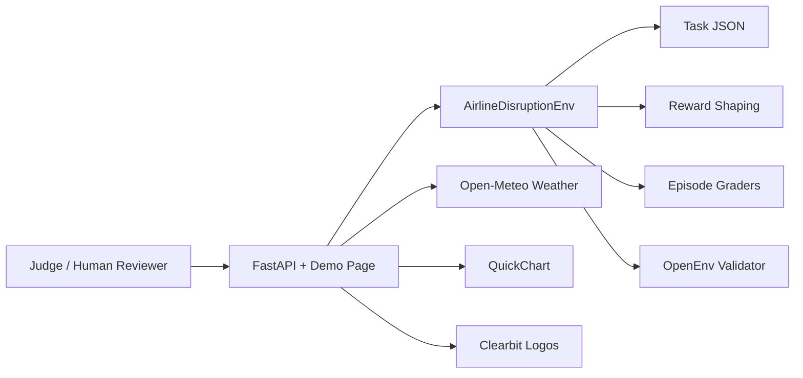

# Airline Disruption Recovery Environment

A deterministic OpenEnv-style simulator where an AI agent handles operational disruption in a hub airport. The environment focuses on practical airline recovery decisions such as gate conflicts, crew recovery, maintenance recovery, weather impact handling, passenger communication, and VIP-sensitive prioritization.

## Problem Statement

Airline disruption recovery is the messy part of operations where a small delay can become a gate conflict, a missed connection, a crew legality issue, and a passenger-service problem all at once. This benchmark asks an agent to make sensible recovery moves under pressure, using the same kind of partial, imperfect information a dispatch team sees in the real world.

## What Makes This Environment Distinct

- It models a dispatch-room style "smallest viable fix first" workflow, exposed through shift notes and action logs.
- Rewards are not just action lookup values; they include sequencing effects, anti-loop behavior, communication timing, and operational trade-offs.
- The hard scenario intentionally combines conflicting priorities (maintenance, crew legality, gate pressure, connection risk, and VIP handling) so agents cannot rely on one-rule policies.
- Task data uses custom airports and flight IDs designed specifically for this benchmark.

This is intentionally written as practical operations code, not a cleaned-up toy benchmark.

## Why This Matters

Disruption recovery is one of the highest-cost airline operations problems. Delays cascade through gates, aircraft, crew legality windows, and passenger connection chains. A lightweight benchmark helps compare agent quality on real operations trade-offs, not just abstract planning.

## Architecture



The backend is the source of truth. The dashboard is there to make the state legible at a glance for humans.

## Project Structure

```txt
airline-disruption-env/
│── app.py
│── inference.py
│── openenv.yaml
│── Dockerfile
│── README.md
│── requirements.txt
│── .env.example
│── .gitignore
│── env/
│   ├── __init__.py
│   ├── models.py
│   ├── environment.py
│   ├── rewards.py
│   ├── graders.py
│   ├── tasks.py
│── data/
│   ├── easy_task.json
│   ├── medium_task.json
│   ├── hard_task.json
│── tests/
│   ├── test_reset.py
│   ├── test_step.py
│   ├── test_graders.py
│   ├── test_rewards.py
```

## Observation Space

Each observation includes:

- airport
- weather
- flights (with delay, gate, crew status, legality, maintenance flags, passenger load, VIP, connection risk)
- available_gates
- backup_crew_count
- completed_actions
- passenger_alerts

## Action Space

Allowed actions:

- assign_backup_crew
- reassign_gate
- delay_flight
- cancel_flight
- reroute_passengers
- hold_connection
- swap_aircraft
- notify_passengers
- reschedule_maintenance
- prioritize_departure

## Reward System

Rewards are shaped per step (not binary):

- Positive reward for useful operational actions
- Bonus for next expected action in sequence
- Small bonus for useful but out-of-order action
- Penalty for invalid action
- Penalty for repeated actions and loop behavior
- Penalty for illegal crew assignment attempt
- Penalty for cancellation-heavy behavior
- Small transparency bonus for early passenger notice
- Additional penalty for unnecessary second-order delays

The model gives agents incremental guidance while still requiring end-to-end strategy quality for top episode grades.

## Why the Graders Are Deterministic

The graders reward concrete action coverage, order, and anti-loop behavior. They do not sample randomness, call external services, or depend on hidden mutable state. That means two agents with different decision sequences can earn different scores, but the same sequence always produces the same result.

## Ops Realism Notes

- `info` includes an `ops_pressure` indicator to emulate controller workload.
- `info` also includes an `action_log_tail` handoff snippet so multi-agent chains can reason about recent operator decisions.
- Passenger notices are deduplicated to avoid artificial score inflation from spammy notification loops.

## APIs Used In The Demo

- Open-Meteo: live weather, wind, precipitation, and thunderstorm context with deterministic fallback to task weather.
- Nominatim: human-readable airport area labels from the fixed airport coordinates used in each scenario.
- Clearbit: airline logos in the flight cards.
- QuickChart: small delay charts inside the decision deck.
- CountAPI: lightweight scenario and action counters visible in the hero summary.
- Google Fonts: Inter and Poppins for a cleaner, more premium UI.

Optional extensions that can be added later if you want a stronger live-ops layer:

- Aviationstack for real flight/aircraft/airport metadata when an API key is available.
- Pantry for lightweight run history storage.
- Nominatim map links or map embeds for stronger geospatial context.

## Tasks

### Easy

- Single gate conflict with waiting passengers
- Expected sequence: `reassign_gate`, `notify_passengers`

### Medium

- Crew shortage with weather delay and connection risk
- Expected sequence: `assign_backup_crew`, `hold_connection`, `notify_passengers`

### Hard

- Storm pressure, maintenance issue, crew timeout risk, gate conflict, VIP sensitivity, and connection risk
- Expected sequence: `swap_aircraft`, `assign_backup_crew`, `reassign_gate`, `hold_connection`, `notify_passengers`

## API

The root URL (`/`) serves a lightweight control-room demo for human reviewers.
Programmatic clients can still use all API routes directly, and `/api` returns a simple machine-readable service summary.

Start server:

```bash
uvicorn app:app --host 0.0.0.0 --port 7860
```

### Reset

```bash
curl -X POST http://127.0.0.1:7860/reset \
  -H "Content-Type: application/json" \
  -d '{"task_name":"easy"}'
```

### Step

```bash
curl -X POST http://127.0.0.1:7860/step \
  -H "Content-Type: application/json" \
  -d '{"action_type":"reassign_gate","flight_id":"NV102","target_gate":"A7"}'
```

### State

```bash
curl http://127.0.0.1:7860/state
```

## Inference Runner

`inference.py`:

- Uses OpenAI Python client initialization
- Reads `API_BASE_URL`, `MODEL_NAME`, `HF_TOKEN`
- Runs easy/medium/hard tasks with deterministic action policy
- Prints logs using exact tokens: `START`, `STEP`, `END`

Run:

```bash
python inference.py
```

## Baseline Scores

With deterministic policy matching each expected solution:

- easy: typically 1.0
- medium: typically 1.0
- hard: typically 1.0

Alternative action order or cancellation behavior will reduce scores.

## Limitations

- This is a recovery benchmark, not a full airline network optimizer.
- It does not ingest live airline operational feeds.
- The live weather, chart, and logo enrichments are for presentation only; the graded environment remains deterministic.
- Some scenario fields are deliberately simplified so the benchmark stays lightweight and reproducible.

## Future Work

- Add more scenario families such as airport closures, inbound aircraft late-arrivals, and crew legality rollover.
- Expand the frontend with small charts for delay trend, reward trend, and action history.
- Add more realistic carrier metadata and richer route networks.
- Add scenario history storage for replay and comparison across agents.
- Add optional screenshot generation for human review packages.

## Docker

Build:

```bash
docker build -t airline-disruption-env .
```

Run:

```bash
docker run -p 7860:7860 airline-disruption-env
```

## Hugging Face Spaces Deployment

1. Create a new Docker Space on Hugging Face.
2. Push this repository.
3. Set optional secrets (`API_BASE_URL`, `MODEL_NAME`, `HF_TOKEN`) if running external inference workflows.
4. Space will expose the FastAPI app on port 7860.

### Optional Visual Enrichment

The demo page can enrich presentation with:

- Open-Meteo for live weather context with fallback to the task weather
- Clearbit for airline logos using carrier domains
- QuickChart for quick delay charts and disruption summaries

These are cosmetic and do not affect scoring.

## Validation

Local checks:

```bash
python -m unittest discover -s tests -p "test_*.py"
```

Manual endpoint checks:

1. POST `/reset` for each task (`easy`, `medium`, `hard`)
2. POST `/step` with valid and invalid actions
3. GET `/state`
4. Run `inference.py` and verify `START/STEP/END` logging format
5. Confirm grader outputs differ across action sequences

OpenEnv checklist items such as runtime limits, memory profile, and endpoint HTTP health can be validated in your CI/deployment pipeline.

## Human Review Notes

- The same environment can look clean in a browser and still stay deterministic under the hood.
- The scenario data, shift notes, and action logs were written specifically for this benchmark.
- Human reviewers should be able to understand the state, the trade-offs, and the recovery intent without reading source code first.
